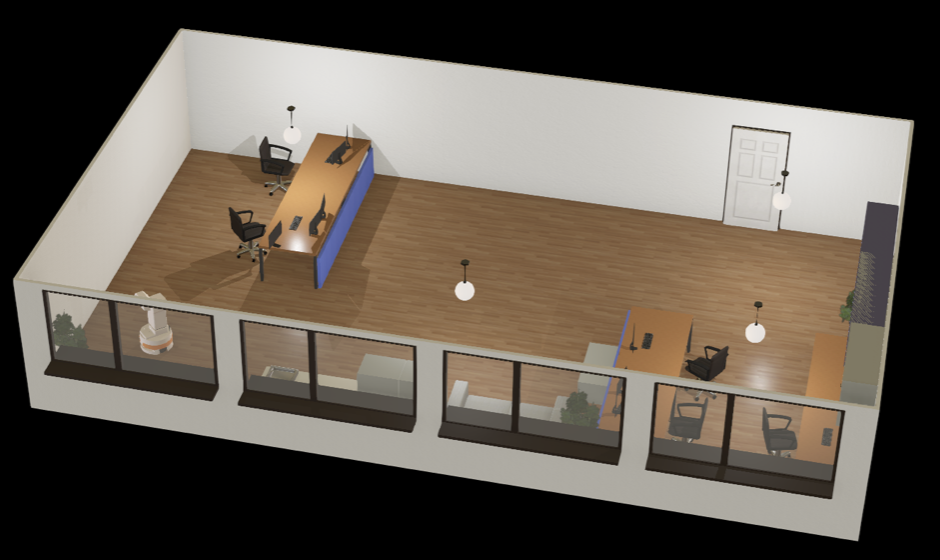
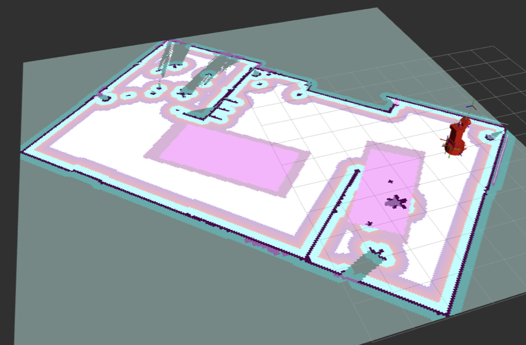
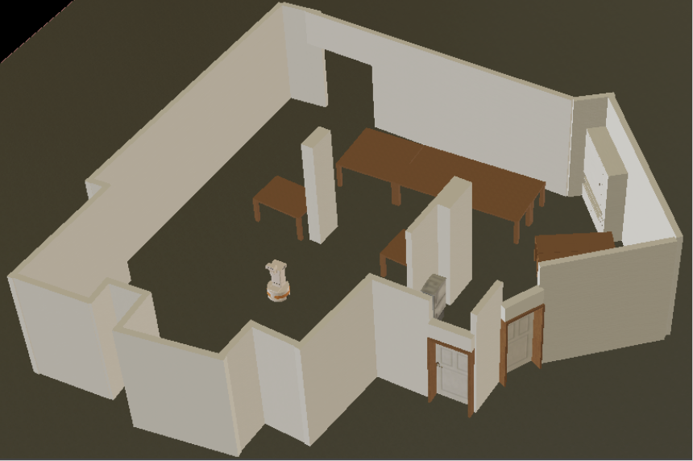
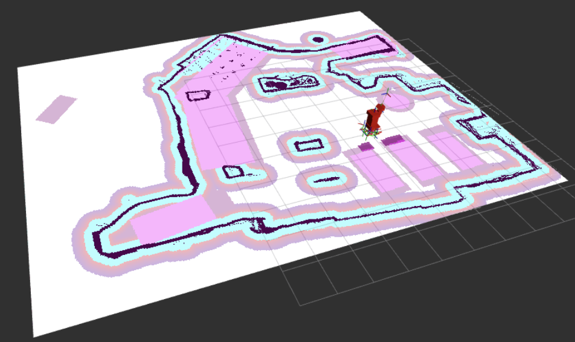
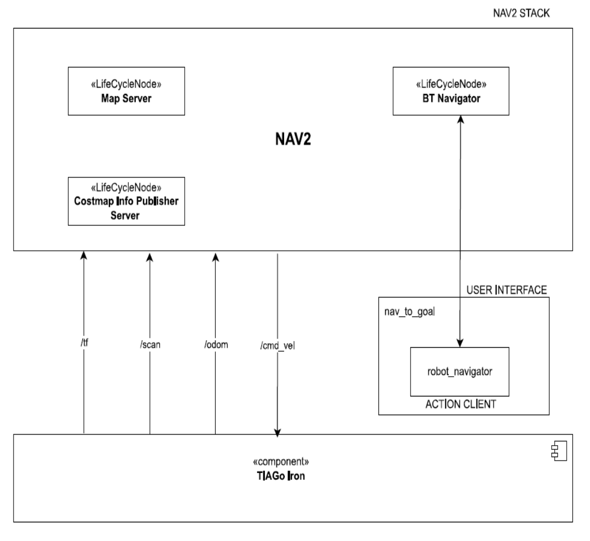

[Software Architecture for Robotics](https://corsi.unige.it/en/off.f/2022/ins/60231)<br>
[M.Sc Robotics Engineering](https://corsi.unige.it/corsi/10635)<br>
[University of Genoa (UniGe), Italy](https://unige.it/en)<br>
**Supervisor:** [Prof. Fulvio Mastrogiovanni](https://rubrica.unige.it/personale/UkNHWFhr) & [Prof. Simone Macciò](https://rubrica.unige.it/personale/UUNAWFho)

# Assignment: Implementation of Keepout Zones on a NAV2 Navigation System

The goal of this assignment is to explore the tools of Nav2, in particular the use of a costmap filter to establish keepout zones. A 3D model of the mobile 
robot TIAGo from PAL RObotics has been modeled to run in a custom 3D world built using Webots simulator. A 2D map of this 3D world is passed to Nav2 
through the use of the Map Server node. The keepout zones are also passed as 2D maps but they are processed by a different server called CostMap Filter. These servers are part of the Nav2 navigation system and have to be set up through the use of specific parameter files.

## Main contents of this Repository ##

* **worlds**: it's a folder containing different `.wbt` files of 3D environments;
* **params**: it's a folder containing different `.yaml` files for the setup of the costmap info server and for the keepout filter;
* **maps**: it's a folder containing all the `.yaml` files with their correspondent `.pgm` files of different 2D maps related to their `.wbt` files in the worlds folder;
* **launch**: it's folder containing the main launch file called `robot_launch.py` and three secondary launch files to load Nav2 navigation system;
* **sofar_assignment**: it's a folder containing the scripts of the node used to control TIAGo's behavior;
* **URDF**: it's a folder containing the information about TIAGo.

## How to run ##

For this assignment, [ROS2 Galactic](https://docs.ros.org/en/galactic/index.html) is required. To install ROS2 Galactic follow the steps on the this [link](https://docs.ros.org/en/rolling/Installation/Ubuntu-Install-Debians.html). After installing ROS2 Galactic, you need [Webots](https://cyberbotics.com/doc/guide/installation-procedure) simulation environment is required. Webots is a  free open-source 3D robot simulator, which you can easily install with the command:

```
 sudo snap install webots
```

In particular, we want to exploit the ROS2-Webots interface which will enable us to create ROS2 simulation scenarios. After installing the simulator, you can install the interface via:

```
sudo apt update
 
sudo apt install ros-galactic-webots-ros2
```
 
Let’s create a package to simulate a 3D turtlebot, making sure to specify dependency from the webots_ros2_driver:
 
```
ros2 pkg create --build-type ament_python --node-name robot_driver <package_name> --dependencies rclpy geometry_msgs webots_ros2_driver
```

Furthermore, we want the simulation of [TIAGo](https://pal-robotics.com/robots/tiago/) robots in Webots environment. To interface ROS2-Webots with a TIAGo robot in simulation [click here](https://github.com/ankurkohli007/webots_ros2/tree/master/webots_ros2_tiago). 

Clone this repository inside the src folder of your workspace:
```
git clone https://github.com/ankurkohli007/Software_Architecture_4_Robotics_Assignment.git
```
Build the package and source:
```
colcon build
 
source install/local_setup.bash
```
Run the simulation:
```
ros2 launch sofar_assignment robot_launch.py
```
 This is the command for the default simulation which launches the default world found in the Webots installation files and the relative costmap that we developed. To launch different costmap just add the following line as an argument of the previous command:
 
Figure below shows the default Webots Environemnt of the TIAGo robot.
 


<p align="center">
    <em>WeBots Environment</em>
</p>
 
Also, figure below shows the default [RViz](http://wiki.ros.org/rviz) environment.
 


The aforementioned task is also performed for the map of [EMARO Lab](https://github.com/EmaroLab) at [University of Genova (UniGe)](https://unige.it/en), Italy. The map is provided by the EMARO Lab team member [Prof. Simone Macciò](https://rubrica.unige.it/personale/UUNAWFho).



Figure shown above is the 3D map of EMARO Lab. This can be design by making changes by the command below:

```
 mask:=src/sofar_assignment/maps/<name-of-the-mask>.yaml
```

where in the `<name-of-the-mask>` field you should put the name of a `.yaml` file present in the maps folder. You can follow the same method to set also the world and its relative 2D map file:
```
ros2 launch sofar_assignment robot_launch.py map:=src/sofar_assignment/maps/emaro_map.yaml world:=src/sofar_assignment/worlds/emaro_lab.wbt mask:=src/sofar_assignment/maps/emaro_keepout_mask2.yaml params_file:=src/sofar_assignment/params/emaro_nav2_params.yaml keepout_params_file:=src/sofar_assignment/params/emaro_keepout_params_2.yaml
```
Also, figure below shows the EMARO Lab [RViz](http://wiki.ros.org/rviz) environment.



## Controlling the robot model ##
The robot can be controlled in two different ways:
* by using rviz user interface to give the robot a goal;
* by running the node `nav_to_goal.py` in another terminal:

  ```
  ros2 run sofar_assignment move_to_goal_exe
  ```

## Architecture of the Assignment ##

To fullfill the requirement the architecture of the assignment is designed as shown in figure below. Here is the idea behind the communication of the nodes: 



## Performance of the TIAGo Robot ## 


Here is the perfomance of the TIAGo Robot in the default environment. 

## Conclusion ##

I'm satisfied with the final result, even if better improvements can be done. First of all some parameters can be changed since they may be not optimal. 

## References ##

* Steve Macenski reposotory for nav2: https://github.com/ros-planning/navigation2
* Tutorial for keepout zones: https://navigation.ros.org/tutorials/docs/navigation2_with_keepout_filter.html

